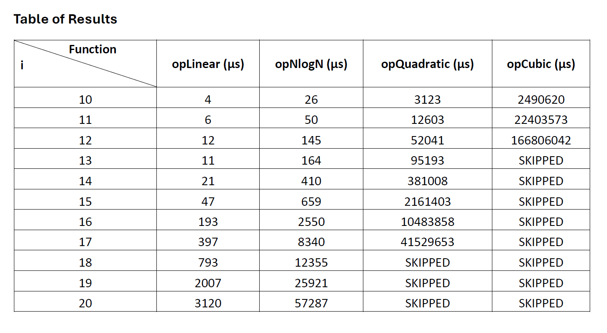
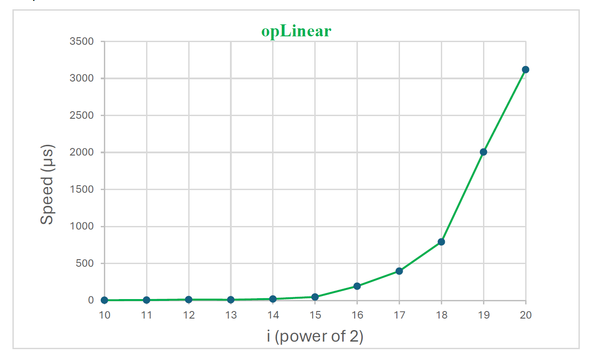
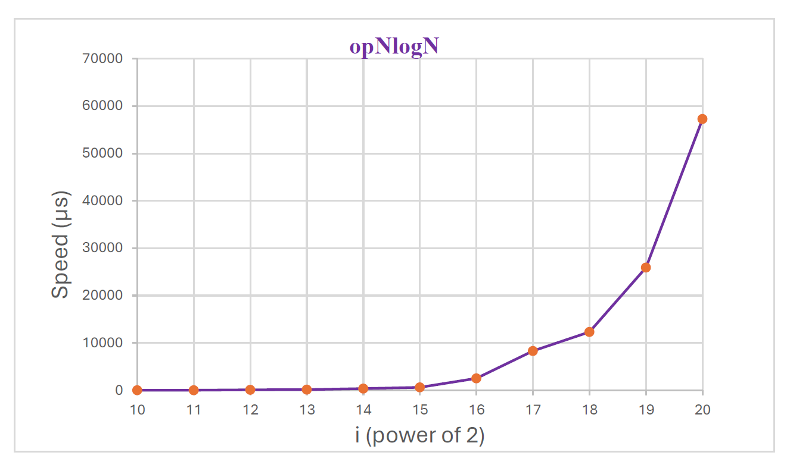
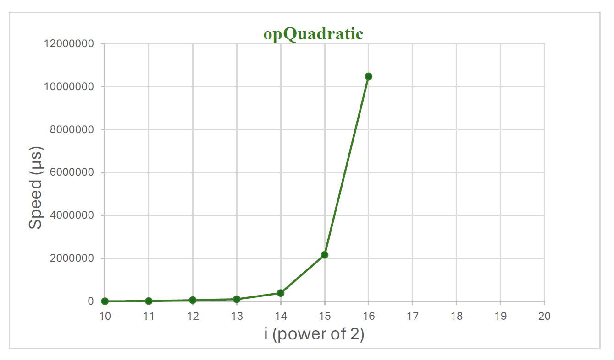
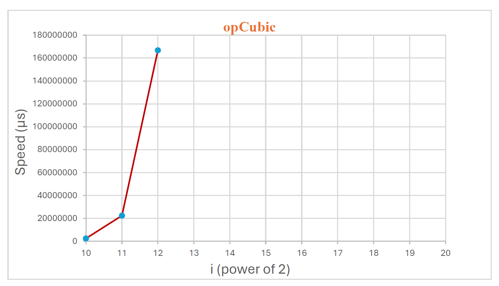

# Algorithm Time Complexity Analysis

## Project Overview

This C++ project experimentally demonstrates how different algorithmic time complexities affect execution time as input size increases.

The program implements and benchmarks four functions representing:

- Linear — O(n)
- Quasilinear — O(n log n)
- Quadratic — O(n²)
- Cubic — O(n³)

Execution times are measured in microseconds using the C++ `<chrono>` library for input sizes based on `n = 2^i`, where `i` ranges from 10 to 20.

This project was originally developed as part of my Data Structures coursework.

## Implementation

The program defines four functions:

- `opLinear(int n)` — linear iteration
- `opNlogN(int n)` — n log n iteration
- `opQuadratic(int n)` — nested iteration demonstrating quadratic growth
- `opCubic(int n)` — three nested loops demonstrating cubic growth

For each input size, the program measures and displays the execution time of each function.

## Technologies & Concepts

- C++
- Data Structures and Algorithms
- Big-O Time Complexity
- Algorithm Performance Analysis
- Runtime Benchmarking
- `std::chrono`

## Experimental Results

The measured execution times for each complexity class are shown below. As the input size increases, the results demonstrate the significant performance differences between linear, quasilinear, quadratic, and cubic growth.

## Runtime Visualizations

The following charts visualize how execution time changes as the input size increases.

## Handling Large Inputs

Quadratic and cubic tests were intentionally skipped at larger input sizes because the number of operations grows rapidly and would result in excessive execution times.

For example:

- At `i = 18`, `n = 2^18 = 262,144`, resulting in approximately 68.7 billion operations for O(n²).
- At `i = 13`, `n = 2^13 = 8,192`, resulting in approximately 549 billion operations for O(n³).

This demonstrates why algorithmic complexity becomes increasingly important as input size grows.

## Observations

- O(n) and O(n log n) remain relatively efficient as input size increases.
- O(n²) execution time increases significantly for larger inputs.
- O(n³) becomes impractical much sooner.
- Actual execution times vary depending on hardware, compiler optimization, memory access, and system load.
- The experimental results demonstrate the practical effect predicted by theoretical Big-O analysis.

## Author

Mahsa Fazli
